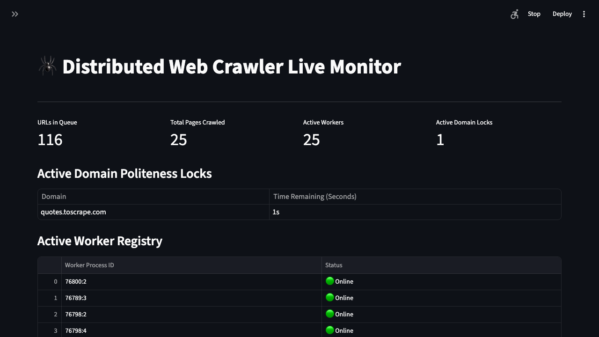

# Distributed, Polite Web Crawler

An end-to-end data ingestion platform, not just a scraping. It combines async I/O, multiprocessing, Redis-backed distributed coordination, and a Postgres ETL pipeline to crawl at scale without hammering target sites or losing state on a crash.

## Why This Project

Most scraping scripts are a single loop with a `requests.get()` call. This is the version of that problem  we could actually build at a company with real traffic: state that survives a crashed worker, deduplication that doesn't fall over at scale, rate limiting that's enforced across a whole fleet instead of per-process, and a real ETL path into a queryable store instead of print statements. It's built to demonstrate the same judgment calls that show up in production data infrastructure — decoupling producers from consumers via a shared queue, trading exactness for memory with a bounded false-positive rate, and making coordination atomic instead of hoping workers behave.

## Live Dashboard



*Mid-crawl: 25 concurrent async workers across a 5-process cluster, sharing one Redis-enforced politeness lock on the target domain, with the queue draining in real time.*

## Architecture

```
┌─────────────────┐
│ Streamlit UI     ├─(User enqueues Seed URL)─┐
└────────┬─────────┘                          │
         │                                    ▼
    (Polls KPIs                          ┌───────────┐
     & domain locks)                     │   REDIS   │
         │                                │ - Frontier (ZSET)
         │                                │ - Bloom filters (BF.*)
         ▼                                │ - Domain locks (NX PX)
┌──────────────────┐                      └─────▲─────┘
│   PostgreSQL DB   │                            │
│  - pages (upsert) │◄──(Atomic UPSERT)─────┐    │ (pop URL, check
│  - Analytics       │                      │    │  bloom filter,
└──────────────────┘                  ┌─────┴────┴─────┐
                                       │  N x Python     │
                                       │  Worker Processes│
                                       │  (asyncio pool  │
                                       │   per process)  │
                                       └─────────────────┘
```

## How It Works

1. **Scale & performance** — `asyncio` + `aiohttp` give non-blocking network I/O within a process; `multiprocessing` (`src/worker/launcher.py`) runs multiple worker processes in parallel to get past the GIL. Each process also runs its own pool of async workers, so the default configuration (5 processes × `MAX_WORKERS=5`) drives up to 25 concurrent fetches, all coordinated through shared Redis state.
2. **Memory-efficient state at scale** — the URL frontier is a Redis Sorted Set (`ZSET`), acting as a shared priority queue so any worker in the cluster can pop the next URL without stepping on another. Visited-URL and seen-content dedup use **RedisBloom** (`BF.ADD` / `BF.EXISTS`) instead of raw string sets, so memory stays flat as the crawl grows into the millions of URLs (at the cost of a small, tunable false-positive rate — an unseen URL is occasionally, rarely, skipped as "already seen"; it never mistakenly re-crawls one that's genuinely done).
3. **Resiliency** — all crawl state (frontier, dedup filters, locks) lives in Redis, not in worker memory. If a worker process or the whole machine dies mid-crawl, restarting picks up exactly where it left off.
4. **Politeness** — `robots.txt` is fetched and cached per process via `urllib.robotparser`. Domain-level rate limiting is enforced with an atomic Redis lock (`SET lock:{domain} active NX PX <delay_ms>`), so no matter how many workers or processes are running, only one request goes out to a given domain per polite-delay window, cluster-wide.
5. **ETL into Postgres** — Extract (async fetch) → Transform (`src/pipeline/parser.py`: strips `<script>`/`<style>`, normalizes whitespace, extracts title + character count) → Load (atomic `INSERT ... ON CONFLICT (url) DO UPDATE` via an `asyncpg` connection pool, so re-crawling a URL updates its row instead of duplicating it).
6. **Live observability** — the Streamlit dashboard (`src/dashboard.py`) polls Redis directly for queue size, pages crawled, worker heartbeats, and active domain locks, without touching the crawl path itself.

## Benchmark

Measured locally against [quotes.toscrape.com](https://quotes.toscrape.com/) (default seed), Redis Stack, and Postgres 16 — not simulated.

**Crawl run** — 5 worker processes × 5 async workers each (25 concurrent), `depth_limit=3`, `polite_delay=1.0s`:

| Metric | Result |
|---|---|
| Pages crawled | 168 |
| Wall-clock time | 191.2s |
| Effective throughput | 0.88 pages/sec |
| Avg. extracted text per page | 999 chars |

That ~0.88 pages/sec is *not* a concurrency ceiling — it's the politeness lock working as designed. Every one of those 25 workers is fighting over a single `lock:quotes.toscrape.com` key, so the whole cluster is intentionally throttled to roughly one request/second against that one domain, matching `POLITE_DELAY`. Point the same cluster at multiple domains and each gets its own independent lock, so throughput scales with domain count, not worker count.

**Bloom filter memory, measured directly with Redis `MEMORY USAGE`:**

| Structure | Items | Memory |
|---|---|---|
| Raw Redis Set (actual crawled URLs) | 168 | 18.5 KB (~110 bytes/URL) |
| RedisBloom filter (`crawler:bloom:urls`) | sized for 1,000,000 @ 0.1% FP rate | 1.93 MB (fixed) |

At this tiny scale the raw Set is smaller — the Bloom filter's cost is dominated by its pre-allocated capacity, not by what's actually in it. That crosses over around **~18,000 URLs**, and the gap only widens from there: extrapolating the measured ~110 bytes/URL out to the filter's full 1M-URL capacity puts the raw Set at **~110 MB** versus the Bloom filter's fixed **~1.93 MB** — roughly **57x smaller** at the scale this design actually targets. The trade is a small, tunable false-positive rate (0.1% here): occasionally an unseen URL gets skipped as "already seen," but a truly-seen one is never mistakenly re-crawled.

## Repo Layout

```
.
├── .streamlit/config.toml    # Dashboard theming
├── docs/dashboard.png        # Live dashboard screenshot
├── sql/schema.sql            # Postgres DDL (pages table + indexes)
├── src/
│   ├── config.py              # Env-var-backed settings (.env)
│   ├── connection.py          # Shared async Redis + Postgres connection pools
│   ├── dashboard.py           # Streamlit live systems monitor
│   ├── pipeline/
│   │   └── parser.py          # HTML cleaning & text/title extraction
│   └── worker/
│       ├── main.py            # DistributedCrawler: fetch, dedup, lock, upsert
│       └── launcher.py        # Multiprocessing harness (N worker processes)
├── main.py                    # Single-process entry point
├── docker-compose.yml         # Redis Stack + Postgres for local dev
├── .env.example
└── requirements.txt
```

## Setup

### Prerequisites
* Python 3.11+
* Docker (recommended), or locally installed **Redis Stack** (RedisBloom module — plain Redis won't work) and **PostgreSQL**

### 1. Install dependencies
```bash
pip install -r requirements.txt
```

### 2. Start infrastructure
```bash
docker compose up -d
```
This starts Redis Stack on `6379` and Postgres on `5432`, and applies `sql/schema.sql` automatically on first boot.

If you're not using Docker, start Redis Stack and Postgres yourself and apply the schema manually:
```bash
psql -U postgres -d crawler -f sql/schema.sql
```

### 3. Configure
```bash
cp .env.example .env
```
Edit `.env` to change seed URLs, allowed domains, worker count, politeness delay, crawl depth, or connection strings. Everything has a sane default if you skip this step.

### 4. Run

Single process (simplest, one asyncio worker pool):
```bash
python main.py
```

Distributed cluster (5 worker processes, matches the architecture above):
```bash
python -m src.worker.launcher
```

Live dashboard:
```bash
streamlit run src/dashboard.py
```
